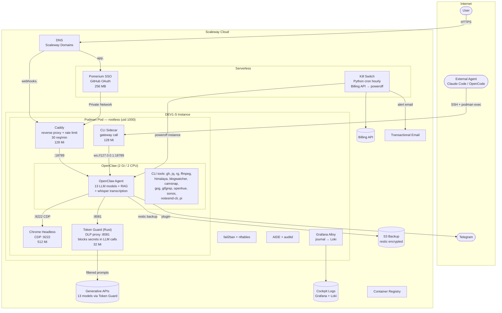

# OpenClaw on Scaleway

Deploy [OpenClaw](https://openclaw.ai) on a single Scaleway DEV1-S instance for **~17 EUR/month**. Everything as code, one `tofu apply`.

## Architecture



## Setup

```bash
# 1. Fork + clone
# Fork this repo on GitHub, then:
git clone git@github.com:<you>/fmj.git && cd fmj

# 2. Configure
cp terraform/terraform.tfvars.example terraform/terraform.tfvars
# Fill in: Scaleway API key (org-level), domain, GitHub OAuth app, GitHub PAT

# 3. Bootstrap (once — creates S3 bucket, encryption key, pushes ~25 GitHub Actions secrets)
cd terraform/bootstrap && tofu init && tofu apply -var-file=../terraform.tfvars

# 4. Commit + push — CI does the rest
git add -A && git commit -m "feat: initial deploy" && git push origin main
```

On first push, CI converges in 2 runs:
1. **Run 1** — builds skip (registry not created yet), apply creates all infrastructure and updates GitHub secrets with registry endpoints
2. **Run 2** (`gh workflow run opentofu.yml`) — builds push all 5 images, apply creates Pomerium container

After initial setup, **routine changes** only need: edit files → `git push` → CI auto-deploys (only rebuilds changed images).

## What you get

- **5 containers** in a Podman rootless pod (OpenClaw, Caddy, Chrome, CLI sidecar, Token Guard)
- **SSO** via Pomerium + GitHub OAuth
- **13 LLM models** via Scaleway Generative APIs (gpt-oss-120b default, pay-per-use)
- **RAG** via bge-multilingual-gemma2 embedding model
- **Audio transcription** via whisper-large-v3 (up to 20 MB)
- **DLP proxy** (Token Guard) — 58 regex patterns block secrets, API keys, credit cards, IBAN, crypto wallets in LLM calls
- **Kill switch** : serverless function checks billing every hour, poweroff at configurable threshold
- **CI/CD** : unified Deploy workflow (builds + apply with `needs`), Trivy scan, Renovate for deps
- **Security** : Lynis 88/100, nftables, fail2ban, AIDE, auditd, rkhunter, debsums, encrypted state
- **Observability** : Cockpit logs via Grafana Alloy, weekly Lynis + Trivy cron audits (Telegram alerts)
- **Backups** : restic to S3, encrypted, daily 2am, 7d/4w/12m retention
- **External agent** : any AI agent (Claude Code, OpenCode) can talk to OpenClaw via SSH

## Module toggles

Everything is enabled by default. Disable what you don't need:

```hcl
# terraform.tfvars
enable_pomerium   = false  # No SSO — direct access via IP:3000
enable_killswitch = false  # No budget protection
enable_monitoring = false  # No Cockpit log shipping (saves ~1 EUR/mo)
enable_backup     = false  # No S3 backups
```

| Variable | Default | What it controls | Cost impact |
|----------|---------|------------------|-------------|
| `enable_pomerium` | `true` | Pomerium SSO gateway + GitHub OAuth | -0.42 EUR/mo |
| `enable_killswitch` | `true` | Hourly billing check + auto-poweroff | free tier |
| `enable_monitoring` | `true` | Cockpit external logs via Alloy | -~1 EUR/mo |
| `enable_backup` | `true` | S3 bucket + restic cron | -~0.10 EUR/mo |

Telegram and Brave Search are soft-toggled: leave vars empty to disable.

## Cost

| | EUR/month |
|---|---|
| DEV1-S + IPv4 | 9.34 |
| Pomerium + Cockpit + Domain | 3.42 |
| LLM API | ~4 |
| **Total** | **~17** |

## Threat model (STRIDE)

| Threat | Protection | Residual risk |
|--------|-----------|---------------|
| **Spoofing** | Pomerium SSO (GitHub OAuth), gateway token auth, SSH Ed25519, 3 least-privilege IAM service accounts | Gateway token in encrypted state only |
| **Tampering** | Encrypted state (AES-GCM), Trivy scan in CI, seccomp RuntimeDefault, readOnlyRootFilesystem, drop ALL caps, SHA-pinned GitHub Actions | cloud-init is first boot only — no runtime integrity check |
| **Repudiation** | Cockpit logs (Alloy → Loki), auditd + AIDE, GitHub Actions audit trail | No audit log on gateway WebSocket API calls |
| **Information Disclosure** | Token Guard DLP proxy (blocks API keys in LLM calls), `sensitive = true` on all secrets, state encryption, private container registries | LLM prompts transit via Scaleway GenAI (trust boundary) |
| **Denial of Service** | Caddy rate_limit 30 req/min, nftables DROP default policy, fail2ban (aggressive SSH), `admin_ip_cidr` SSH restriction | Kill switch endpoint is public (token-protected) |
| **Elevation of Privilege** | Podman rootless (uid 1000), drop ALL caps, no shell for `openclaw` user, 3 separate IAM accounts, security group per-port rules | Root SSH (restricted to `admin_ip_cidr`) |

### Agent interaction surface

An external AI agent (Claude Code, OpenCode, etc.) can interact with the enclave:

```
Agent → SSH (Ed25519) → root@instance → podman exec → CLI sidecar → gateway call → OpenClaw
```

- **Auth**: SSH key + gateway token (both auto-generated, stored in encrypted state)
- **Scope**: `chat.send` and `chat.history` only (WebSocket gateway API)
- **Isolation**: CLI sidecar runs in 128 Mi container, shares config volume (not rootfs)
- **DLP**: Token Guard intercepts all LLM calls — blocks secrets even from agent-initiated prompts
- **Risk**: if gateway call fails, CLI falls back to embedded agent (OOM at 128 Mi — by design)

### OpenClaw capabilities in this deployment

| Capability | Component | Sandbox |
|-----------|-----------|---------|
| LLM (13 models) | Scaleway GenAI via Token Guard | 58-pattern DLP proxy (API keys, PEM, credit cards, IBAN, crypto wallets) |
| RAG / memory search | bge-multilingual-gemma2 embedding | Via Token Guard |
| Audio transcription | whisper-large-v3 (max 20 MB) | Via Scaleway GenAI |
| Web browsing | Chrome headless (CDP :9222) | Separate container, 512 Mi, no host access |
| Email | himalaya CLI | In OpenClaw container |
| GitHub | gh CLI (`GH_TOKEN`) | In OpenClaw container |
| Media processing | ffmpeg, ffprobe | In OpenClaw container |
| Smart home | openhue, sonos CLIs | In OpenClaw container |
| Search & content | blogwatcher, gifgrep, camsnap, gog | In OpenClaw container |
| Notes | notesmd-cli (Obsidian) | In OpenClaw container |
| Code | pi (coding-agent), jq, rg | In OpenClaw container |
| Telegram | Channel (chat) + plugin (alerts) | Outbound only via Caddy |
| File system | `/home/openclaw/` volumes | readOnlyRootFilesystem, tmpfs for /tmp |
| External agent comms | CLI sidecar (gateway call) | 128 Mi, WebSocket only |

## Prerequisites

- [Scaleway account](https://console.scaleway.com/register) + API key (**scope: Organization**, not project-level)
- Domain name ([Scaleway Domains](https://console.scaleway.com/domains/) or set `domain_owner_contact`)
- [GitHub OAuth App](https://github.com/settings/developers) (callback: `https://auth.<domain>/oauth2/callback`) — only if `enable_pomerium = true`
- [GitHub PAT](https://github.com/settings/tokens) scope `repo` — for auto-configuring Actions secrets
- [OpenTofu >= 1.8](https://opentofu.org/docs/intro/install/)

### Scaleway API key scopes

You need **2 separate API keys**:

| Key | Scope | Used for |
|-----|-------|----------|
| Main API key (`scw_access_key`) | **Organization-level** | All resources: project, instance, DNS, IAM, TEM, containers, registry, billing |
| State S3 key (`backend.conf`) | **ObjectStorageFullAccess** on state bucket project | S3 backend read/write for OpenTofu state |

The main key must be org-level because it creates the Scaleway project and manages org-level resources (DNS, TEM, IAM).

### GitHub tokens (3 distinct tokens)

| Token | Type | Scope | Usage |
|-------|------|-------|-------|
| `github_token` | Classic PAT | `repo` | Auto-configure GitHub Actions Secrets via OpenTofu |
| `RENOVATE_TOKEN` | Classic PAT | `repo` | Renovate dependency management (manual secret) |
| `github_agent_token` | Fine-grained PAT | `Contents`, `Issues`, `Pull requests` | OpenClaw agent access to private repos (optional) |

## After deploy

```bash
# SSH
tofu output -raw ssh_private_key > ~/.ssh/openclaw && chmod 600 ~/.ssh/openclaw
ssh -i ~/.ssh/openclaw root@$(tofu output -raw instance_public_ip)

# Podman (rootless)
ssh root@<IP> "cd /tmp && sudo -u openclaw XDG_RUNTIME_DIR=/run/user/1000 podman pod ps"

# Talk to OpenClaw from an external agent
IDEMPOTENCY="cc-$(date +%s)"
MSG="Hello from Claude Code"
JSON='{"sessionKey":"agent:main:main","message":"'"$MSG"'","idempotencyKey":"'"$IDEMPOTENCY"'"}'
B64=$(echo -n "$JSON" | base64)
TOKEN="<gateway_token>"  # tofu output -raw gateway_token
ssh -i ~/.ssh/openclaw root@<IP> "cd /tmp && sudo -u openclaw XDG_RUNTIME_DIR=/run/user/1000 \
  podman exec -e PARAMS_B64=$B64 openclaw-cli sh -c \
  'openclaw gateway call chat.send --url ws://127.0.0.1:18789 --token $TOKEN --params \"\$(echo \$PARAMS_B64 | base64 -d)\"'"
```

## Backup & Restore

Nightly encrypted backups to Scaleway S3 via restic (2am daily). Telegram alert on success.

**What's backed up**: `/home/openclaw/config`, `/home/openclaw/caddy`, `/etc/ssh/sshd_config.d`, `/etc/audit/rules.d`

**Retention**: 7 daily, 4 weekly, 12 monthly snapshots.

### Save your backup credentials

```bash
# These are the ONLY way to restore. Save them somewhere safe.
tofu output -raw backup_password    # restic encryption password
tofu output backup_repository       # S3 repository URL
```

### Restore after rebuild

```bash
# Set credentials
export RESTIC_REPOSITORY=$(tofu output -raw backup_repository)
export RESTIC_PASSWORD=$(tofu output -raw backup_password)
export AWS_ACCESS_KEY_ID=<backup_access_key>     # from state or tofu output
export AWS_SECRET_ACCESS_KEY=<backup_secret_key>

# List snapshots
restic snapshots

# Restore to new instance
ssh root@<IP> "cd /tmp && sudo -u openclaw XDG_RUNTIME_DIR=/run/user/1000 podman pod stop openclaw"
restic restore latest --target /tmp/restore
scp -r /tmp/restore/home/openclaw/config root@<IP>:/home/openclaw/config
ssh root@<IP> "chown -R openclaw:openclaw /home/openclaw/config"
ssh root@<IP> "cd /tmp && sudo -u openclaw XDG_RUNTIME_DIR=/run/user/1000 podman pod start openclaw"
```

**Gotcha**: Telegram pairing must be re-done after restore (credentials are per-instance).

## CI/CD (fork guide)

The main `Deploy` workflow (`opentofu.yml`) handles everything: path detection, image builds, and OpenTofu apply with `needs` dependencies. Standalone build workflows are kept for manual `workflow_dispatch` only.

Fork this repo and set these GitHub Actions secrets:

| Secret | Description |
|--------|-------------|
| `SCW_ACCESS_KEY` | Scaleway access key (auto-set by `tofu apply` if `github_token` provided) |
| `SCW_SECRET_KEY` | Scaleway secret key |
| `SCW_ORGANIZATION_ID` | Scaleway organization ID |
| `SCW_REGISTRY_ENDPOINT` | Container registry endpoint |
| `TF_VAR_encryption_passphrase` | State encryption passphrase (min 16 chars) |
| `TF_VAR_admin_email` | Your email |
| `TF_VAR_admin_ip_cidr` | Your IP in CIDR (e.g. `1.2.3.4/32`) |
| `TF_VAR_domain_name` | Your domain |
| `TF_VAR_openclaw_version` | OpenClaw version (semver) |
| `RENOVATE_TOKEN` | GitHub PAT for Renovate (manual, scope `repo`) |

If `github_token` is set in tfvars, `tofu apply` auto-creates all secrets except `RENOVATE_TOKEN`.

## Destroy

```bash
cd terraform && tofu destroy
cd bootstrap && tofu destroy
```

## License

[MIT](LICENSE)
